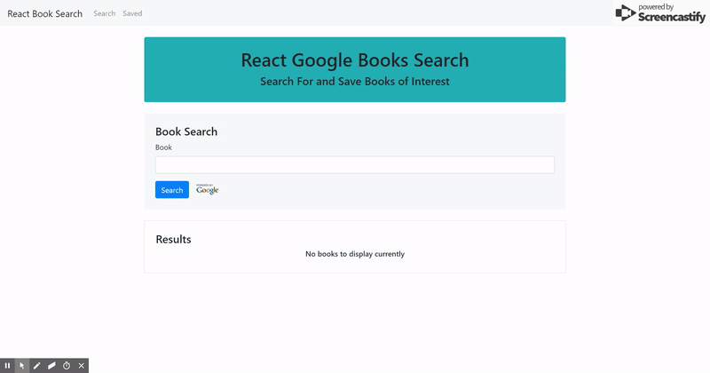
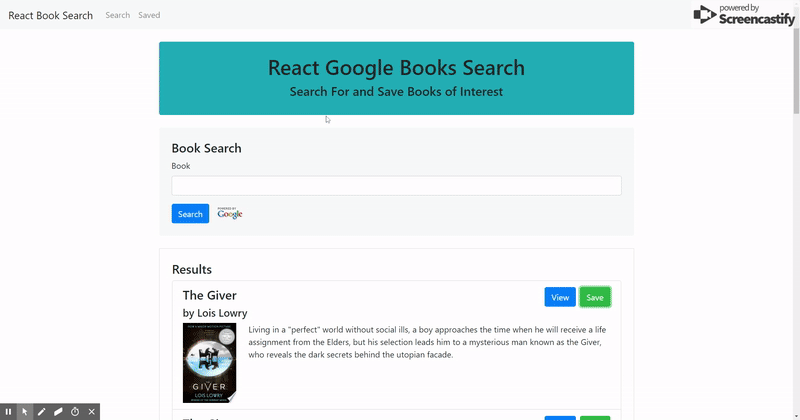

# google-books

React Google Books is a MERN-stack app that allows users to search for books of interest! Books can be saved to and deleted from the 'favorites' list.

This project was created as an assignment from Penn LPS Coding Bootcamp.

## Assignment Parameters

* This application requires at minimum 2 pages, check out the following mockup images for each page:

  * [Search](client/public/img/readme/Search.png) - User can search for books via the Google Books API and render them here. User has the option to "View" a book, bringing them to the book on Google Books, or "Save" a book, saving it to the Mongo database.

  * [Saved](client/public/img/readme/Saved.png) - Renders all books saved to the Mongo database. User has an option to "View" the book, bringing them to the book on Google Books, or "Delete" a book, removing it from the Mongo database.

## Getting started

Type in the name of a book to find that book in the search results! You can click the green 'Save' button to add books to your 'Saved' list.

Click 'Saved' on the navbar to view books that you've saved. Saved books can be deleted by clicking the red 'Delete' button.

Click the blue 'View' button on either the 'Search' or 'Saved' page to view more information about the book on the Google Books website.

## About

This app uses React to handle the view and functionality, Express and Node for server-side API routing, and MongoDB for storing the user's saved books.

Technologies used: MongoDB, Express, React, Node, Mongoose, Bootstrap, Google Books API

## Links

- Deployed: https://google-books-sdreyes.herokuapp.com/
- Repository: https://github.com/sdreyes/google-books
- Google Books API: https://developers.google.com/books/

## Author

- Shelby Reyes: https://sdreyes.github.io/